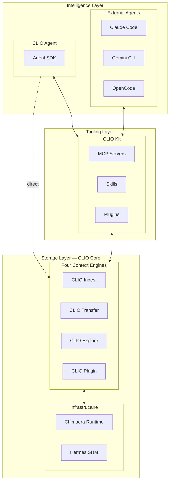

# IOWarp — Context Engineering for Autonomous AI Agents

**IOWarp** is an NSF-funded ($5M, Award #2411318) open-source context engineering platform enabling autonomous AI agents to orchestrate petabyte-scale scientific discovery.

**CLIO** (Context Layer for IO) is the software platform — transforming scattered data, metadata, telemetry, and computational state into unified, actionable intelligence for AI agents.

---

## Three-Layer Architecture

| Layer | Name | Purpose |
|-------|------|---------|
| **Intelligence** | **CLIO Agent** | Autonomous agents for scientific data management, multi-agent coordination |
| **Tooling** | **CLIO Kit** | 15+ MCP servers with 150+ tools for scientific computing |
| **Storage** | **CLIO Core** | Four context engines for multi-tier data orchestration (GPU HBM to tape) |

### Four Core Engines

- **CLIO Ingest** — "The Way In" — ingests 14+ scientific formats (HDF5, NetCDF, Zarr, ROOT, FITS)
- **CLIO Transfer** — "The Mover" — ML-based predictive data movement across storage tiers
- **CLIO Explore** — "The Finder" — natural language queries at petabyte scale
- **CLIO Plugin** — "The Connector" — HPC scheduler, storage, and instrument integration

---

## Key Metrics

- **7.5x** faster scientific workflows
- **2.6x** DRAM reduction
- **150+** agent tools via MCP
- **25+** peer-reviewed publications
- **2** Best Paper Awards (SC, HPDC)
- Deployed at **3+ national labs** (LLNL, ANL, NERSC)

---

## Getting Started

| Repository | Description | Install |
|------------|-------------|---------|
| [**iowarp**](https://github.com/iowarp/iowarp) | Core platform (CLIO Core engines, Hermes, Chimaera) | `pip install iowarp` |
| [**clio-kit**](https://github.com/iowarp/clio-kit) | 15+ MCP servers and 150+ agent tools | `uvx clio-kit mcp-servers` |
| [**clio-agent**](https://github.com/iowarp/clio-agent) | CLIO Agent framework | `pip install clio-agent` |
| [**docs**](https://github.com/iowarp/docs) | Technical documentation | [docs.iowarp.ai](https://docs.iowarp.ai) |

---

## Documentation

| Resource | URL |
|----------|-----|
| Platform Overview | [iowarp.ai/platform](https://iowarp.ai/platform/) |
| Getting Started | [docs.iowarp.ai/docs/getting-started](https://docs.iowarp.ai/docs/getting-started/installation) |
| MCP Servers Reference | [docs.iowarp.ai/docs/agent-toolkit/mcp](https://docs.iowarp.ai/docs/agent-toolkit/mcp) |
| CLIO Kit Showcase | [toolkit.iowarp.ai](https://toolkit.iowarp.ai) |
| SDK Reference | [docs.iowarp.ai/docs/sdk](https://docs.iowarp.ai/docs/sdk/interprocess) |
| Full Documentation | [docs.iowarp.ai](https://docs.iowarp.ai) |

---

## Community

| Channel | Purpose |
|---------|---------|
| [Zulip Chat](https://iowarp.zulipchat.com) | Real-time discussions and support |
| [GitHub Issues](https://github.com/iowarp/iowarp/issues) | Bug reports and feature requests |
| [Website](https://iowarp.ai) | Project information and updates |

---

## Contributing

We welcome contributions across all repositories. See individual CONTRIBUTING.md files for guidelines.

**Development workflow:**
1. Fork the relevant repository
2. Create a feature branch
3. Follow coding standards (Google C++ Style Guide for C++, PEP 8 for Python)
4. Submit a pull request with tests

---

## Team

Built by **[Gnosis Research Center](https://iowarp.ai/about/)** at Illinois Institute of Technology, with University of Utah and The HDF Group.

---

## License

All IOWarp repositories are licensed under the **BSD 3-Clause License**.

**Copyright (c) 2024-2026, Gnosis Research Center, Illinois Institute of Technology**

---

  <a href="https://iowarp.ai/about/">Gnosis Research Center</a> ·
  <a href="https://iowarp.ai">iowarp.ai</a> ·
  <a href="https://docs.iowarp.ai">docs.iowarp.ai</a> ·
  <a href="https://toolkit.iowarp.ai">toolkit.iowarp.ai</a> ·
  <a href="https://github.com/iowarp">GitHub</a>

