# IOWarp

**A Context Management Platform bridging AI agents and high-performance scientific computing.**

IOWarp enables AI agents to orchestrate large-scale scientific data, execute complex multi-step workflows, and manage computational context across heterogeneous storage tiers. Developed at the [Gnosis Research Center](https://grc.iit.edu/) at Illinois Institute of Technology with support from the National Science Foundation.

---

## What is Context Management?

Context Management is the systematic handling of data, state, and computational artifacts that AI agents need to perform scientific tasks. Unlike traditional data management focused on storage, Context Management addresses:

- **Context Transfer**: Moving data efficiently across memory/storage tiers with microsecond latency
- **Context Assimilation**: Ingesting and transforming heterogeneous scientific data formats
- **Context Exploration**: Enabling AI agents to discover, query, and understand datasets

IOWarp provides the infrastructure layer that lets AI agents focus on science rather than data plumbing.

---

## Architecture

IOWarp implements a three-tier architecture where everything works together as a unified platform:

```mermaid
graph TB
    subgraph Intelligence["🧠 Intelligence Layer"]
        direction LR
        subgraph External["External Agents"]
            CC[Claude Code]
            GC[Gemini CLI]
            OC[OpenCode]
        end
        subgraph Framework["Claudio Framework"]
            CL[Claudio SDK<br/><i>coming soon</i>]
        end
    end

    subgraph Tool["🔧 Tool Layer"]
        direction LR
        subgraph Toolkit["Agent Toolkit"]
            MCP[MCP Servers]
            SK[Skills]
            PL[Plugins]
        end
        JCD[Jarvis-CD<br/><i>runtime-deployment</i>]
    end

    subgraph Storage["💾 Storage Layer"]
        subgraph Engines["Context Engines"]
            direction LR
            CTE[Context Transfer Engine<br/><i>context-transfer-engine</i>]
            CAE[Context Assimilation Engine<br/><i>core</i>]
            CEE[Context Exploration Engine<br/><i>core</i>]
        end
        subgraph Infra["Infrastructure"]
            direction LR
            RT[Chimaera Runtime<br/><i>runtime</i>]
            CTP[Transport Primitives<br/><i>context-transport-primitives</i>]
        end
    end

    External <--> Toolkit
    Framework <--> Toolkit
    Framework -.->|direct| Engines
    Toolkit <--> Engines
    Toolkit <--> JCD
    Engines <--> Infra
```

| Layer | Purpose | Components |
|-------|---------|------------|
| **Intelligence** | Agentic interfaces & orchestration | External agents (Claude Code, Gemini CLI, OpenCode) + Claudio framework |
| **Tool** | AI-powered tooling for scientific workflows | Agent Toolkit (16 MCP servers, skills, plugins) + Jarvis-CD deployment |
| **Storage** | High-performance context management | 3 Context Engines + Chimaera Runtime + Transport Primitives |

---

## Repositories

### Getting Started

| Repository | Description | Install |
|------------|-------------|---------|
| [**iowarp**](https://github.com/iowarp/iowarp) | Unified platform installation and CLI | `pip install iowarp` |
| [**agent-toolkit**](https://github.com/iowarp/agent-toolkit) | 16 MCP servers, skills, and plugins for AI agents | `uvx iowarp-agent-toolkit mcp-servers` |

### Storage Layer

| Repository | Component | Description |
|------------|-----------|-------------|
| [**core**](https://github.com/iowarp/core) | All Engines | Unified monorepo: Assimilation + Exploration engines (for contributors) |
| [**context-transfer-engine**](https://github.com/iowarp/context-transfer-engine) | CTE | Heterogeneous-aware, multi-tiered I/O buffering |
| [**runtime**](https://github.com/iowarp/runtime) | Chimaera | High-performance modular runtime, coroutine-based execution |
| [**context-transport-primitives**](https://github.com/iowarp/context-transport-primitives) | Primitives | Shared memory data structures with CUDA/ROCm support |

### Tool Layer

| Repository | Description |
|------------|-------------|
| [**agent-toolkit**](https://github.com/iowarp/agent-toolkit) | MCP servers, skills, plugins for scientific computing |
| [**runtime-deployment**](https://github.com/iowarp/runtime-deployment) | Jarvis-CD: unified deployment platform for HPC applications |
| [**ppi-jarvis-util**](https://github.com/iowarp/ppi-jarvis-util) | Python utilities for shell scripting, SSH, MPI operations |

### Intelligence Layer

| Component | Status | Description |
|-----------|--------|-------------|
| **Claudio** | Coming soon | Agent SDK framework for meta-prompting and orchestration |

---

## Key Capabilities

### For AI/ML Engineers
- **16 MCP Servers**: HDF5, Slurm, ArXiv, Pandas, Parquet, Darshan, ParaView, and more
- **Natural language data access**: "Analyze the temperature dataset in this HDF5 file"
- **Workflow orchestration**: Submit jobs, monitor progress, retrieve results

### For HPC Researchers
- **7.5x demonstrated speedup** in real-world scientific workflows
- **Multi-tiered buffering**: RAM → NVMe → SSD → HDD with intelligent data placement
- **Sub-10μs task latency** via coroutine-based runtime

### For Systems Developers
- **Modular ChiMod system**: Extend the runtime with custom processing modules
- **GPU-aware memory**: CUDA and ROCm compatible shared memory primitives
- **Distributed architecture**: Single node to cluster deployments

---

## Use Cases

IOWarp accelerates workflows across scientific domains:

- **Climate Modeling**: Efficient I/O for large-scale simulation outputs
- **Bioinformatics**: Genomic data processing and analysis pipelines
- **Materials Science**: Multi-physics simulation data management
- **Machine Learning**: Training data pipelines and model artifact storage
- **High-Energy Physics**: Event data processing and analysis

---

## Documentation

| Resource | Description |
|----------|-------------|
| [Platform Overview](https://iowarp.ai/platform) | Architecture and design principles |
| [Quick Start](https://iowarp.ai/docs/intro) | Installation and first steps |
| [Agent Toolkit Docs](https://iowarp.github.io/agent-toolkit/) | MCP server reference and examples |
| [API Reference](https://grc.iit.edu/docs/category/iowarp/) | Technical documentation |

---

## Community

| Channel | Purpose |
|---------|---------|
| [Zulip Chat](https://iowarp.zulipchat.com) | Real-time discussions and support |
| [GitHub Issues](https://github.com/iowarp/iowarp/issues) | Bug reports and feature requests |
| [Website](https://iowarp.ai) | Project information and updates |

---

## Contributing

We welcome contributions across all repositories. See individual repository CONTRIBUTING.md files for guidelines.

**Development workflow:**
1. Fork the relevant repository
2. Create a feature branch
3. Follow the coding standards (Google C++ Style Guide for C++, PEP 8 for Python)
4. Submit a pull request with clear description and tests

For core platform development, start with the [core](https://github.com/iowarp/core) repository.

---

## License

All IOWarp repositories are licensed under the **BSD 3-Clause License**.

**Copyright (c) 2024-2026, Gnosis Research Center, Illinois Institute of Technology**

---

  <a href="https://grc.iit.edu/">Gnosis Research Center</a> ·
  <a href="https://iowarp.ai">iowarp.ai</a> ·
  <a href="https://github.com/iowarp">GitHub</a>

